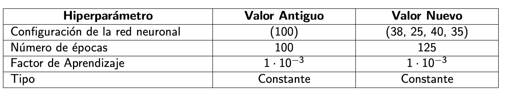

## Índice

1. [📝 Introducción](#Introducción)
2. [✈️ Gestión del Tráfico Aéreo](#Gestión_Del_Tráfico_Aéreo)
3. [🛬 Configuración de las pistas](#Configuración_De_Las_Pistas)
4. [🛫 Aeropuerto Adolfo Suárez Madrid-Barajas](#Aeropuerto_Adolfo_Suárez_Madrid-Barajas)
5. [✅ Objetivos del proyecto](#Objetivos_Del_Proyecto)
6. [📚 Conjunto y Modelo de Datos](#Conjunto_Y_Modelo_De_Datos)
7. [🦾 Modelos de Aprendizaje Automático](#Modelos_De_Aprendizaje_Automático)
8. [⏮ Prueba Inicial de Modelos](#Prueba_Inicial_De_Modelos)
9. [🌲 Bosques Aleatorios](#Bosques_Aleatorios)
10. [🏘 K-Vecinos más Cercanos](#K-Vecinos_Más_Cercanos)
11. [📈 Regresión Logística](#Regresión_Logística)
12. [🤖 Redes Neuronales](#Redes_Neuronales)
13. [🛠 Optimización de los modelos](#Optimización_De_Los_Modelos)
14. [🌲 Bosques Aleatorios](#Bosques_Aleatorios)
15. [🏘 K-Vecinos más Cercanos](#K-Vecinos_Más_Cercanos)
16. [📈 Regresión Logística](#Regresión_Logística)
17. [🤖 Redes Neuronales](#Redes_Neuronales)
18. [🤼‍♀️ Comparativa de la mejora entre el modelo Base y el modelo optimizado](#Comparativa_De_La_Mejora_Entre_El_Modelo_Base_Y_El_Modelo_Optimizado)
19. [💯 Evaluación de los modelos](#Evaluación_De_Los_Modelos)
20. [🏛 Arquitectura Lógica de la herramienta](#Arquitectura_Lógica_De_La_Herramienta)
21. [⚙️ Estructura del Proyecto](#Estructura_Del_Proyecto)
22. [📷 Capturas de pantalla](#Capturas_De_Pantalla)
23. [🔚 Conclusiones y Trabajo Futuro](#Conclusiones_Y_Trabajo_Futuro)
24. [🔚 Conclusiones](#Conclusiones)
25. [🔮 Trabajo Futuro](#Trabajo_Futuro)

Repositorio del proyecto fin de grado: **Selección y Optimización de algoritmos para la predicción de configuraciones en aeropuertos** Link a la web con la memoria oficial: [UVaDoc](https://uvadoc.uva.es/handle/10324/41331)

# 📝 Introducción <a name="Introducción"></a>
## ✈️ Gestión del Tráfico Aéreo <a name="Gestión_Del_Tráfico_Aéreo"></a>
* En los últimos años el número de transacciones aéreas ha crecido de manera exponencial y se espera que esta cifra siga aumentando a lo largo de los próximos años.
* Para poder albergar esta cantidad de vuelos, los aeropuertos han de disponer de una buena infraestructura (número de pistas, orientación, accesos, etc) y contar con una buena **gestión del tráfico aéreo.**

**Gestión del Tráfico Aéreo: La gestión del tráfico aéreo comprende todas aquellas acciones e interacciones que se llevan a cabo para ayudar a una aeronave a trasladarse de un aeródromo de origen a otro de destino de una forma segura.**

## 🛬 Configuración de las pistas <a name="Configuración_De_Las_Pistas"></a>

En este proyecto nos vamos a centrar en las pistas y en su configuración. *Una pista es una superficie rectangular destinada a la realización de las maniobras de aterrizaje y despegue por parte de las aeronaves.*

Dependiendo de su relevancia pueden ser de dos tipos:
* **Pista principal:** Pista que se utiliza de forma usual en el aeropuerto
siempre y cuando las condiciones para su uso sean adecuadas.
* **Pista Secundaria:** Pista auxiliar que se utiliza cuando la pista
principal no se encuentre disponible ya sea por motivos meteorológicos o por motivos logísticos.

**La configuración de las pistas hace referencia al número, orientación y agrupamiento de las pistas dentro de un aeropuerto.** Los principales tipos de configuración de las pistas son los siguientes:

* **Pistas Simples:** Consta de una única pista en la que se llevan a cabo las operaciones de aterrizaje o de despegue.
* **Pistas Paralelas:** Combinación de dos o más pistas simples.
* **Pistas que se cortan:** Combinación de dos o más pistas simples de manera que existe una intersección entre ambas.
* **Pistas en V abierta:** Combinación de dos pistas simples en direcciones opuestas que no llegan a cortarse nunca.

### 🛫 Aeropuerto Adolfo Suárez Madrid-Barajas <a name="Aeropuerto_Adolfo_Suárez_Madrid-Barajas"></a>

Es el aeropuerto más grande de España y el 5º más grande de Europa. Dispone de 4 pistas dispuestas en paralelo 2 a 2 (14L, 14R, 18L, 18R, 32L, 32R, 36L, 36R).

Las pistas se encuentran distribuidas en 2 configuraciones distintas (Ver Figura 1):

* **Configuración Norte:** Aterrizajes (32L y 32R); Despegues (36L y 36R).
* **Configuración Sur:** Aterrizajes (18L y 18R); Despegues (14L y 14R).


**Figura 1: Configuración de pistas del aeropuerto de Madrid-Barajas.**


## ✅ Objetivos del proyecto <a name="Objetivos_Del_Proyecto"></a>
Los objetivos fijados para este proyecto son:
* **Procesamiento y análisis** de los datos de los vuelos.
* **Prueba y optimización** de modelos de aprendizaje automático.
* **Evaluación y selección** del modelo de aprendizaje automático final.
* **Diseño e implementación** de un *dashboard* de visualización e interacción con el modelo de aprendizaje automático.

# 📚 Conjunto y Modelo de Datos <a name="Conjunto_Y_Modelo_De_Datos"></a>

El conjunto de datos utilizado se encuentra constituido por registros individuales de operaciones de aterrizaje y despegue llevadas a cabo en el Aeropuerto de Barajas durante los años 2018 y 2019. Consta de 733.825 registros de vuelos, de los cuáles 346.198 (aproximadamente el 47,17%) pertenecen a operaciones realizadas durante el año 2018, mientras que 387.627 (52,83 %) corresponden al año 2019. Además se dispone de información relativa al vuelo, la meteorología en el momento de realizar la maniobra y los datos de la aeronave en dicho momento.

El diagrama de clases en el que se encuentran estructuradas las distintas características que conforman el conjunto de datos es el siguiente:


**Figura 2: Diagrama de Clases de los datos del proyecto.**

# 🦾 Modelos de Aprendizaje Automático <a name="Modelos_De_Aprendizaje_Automático"></a>

Para la prueba de los modelos de aprendizaje automático, se han generado cuatro subconjuntos de datos distintos:
* **FULL:** Todas las características y *Target* multicolumna.
* **FNORM:** Todas las características y *Target* normalizado.
* **RELATED:** Todas las características **relacionadas** y *Target* multicolumna.
* **RNORM:** Todas las características **relacionadas** y *Target* normalizado.

Estos subconjuntos han sido probados en los siguientes modelos de aprendizaje automático en su configuración base de [scikit-learn](https://scikit-learn.org/stable/):
* **Bosques Aleatorios.**
* **K-Vecinos Más Cercanos.**
* **Regresión Logística.**
* **Redes Neuronales.**

## ⏮ Prueba Inicial de modelos <a name="Prueba_Inicial_De_Modelos"></a>
### 🌲 Bosques Aleatorios <a name="Bosques_Aleatorios"></a>
Modelo basado en Bosques Aleatorios:
* **Número de árboles:** Variable.
* **Profundidad:** Sin límite.
* **Mínimo de ejemplos para dividir nodo interno:** 2.
* **Mínimo de ejemplos por nodo hoja:** 1.


**Figura 3: Precisión del modelo basado en Bosques Aleatorios con la configuración base.**

### 🏘 K-Vecinos Más Cercanos <a name="K-Vecinos_Más_Cercanos"></a>
Modelo basado en K-Vecinos Más Cercanos:
* **Número de vecinos:** Variable.
* **Pesos:** Uniforme.
* **Distancia:** *Minkowski*.


**Figura 4: Precisión del modelo basado en K-Vecinos más Cercanos con la configuración base.**

### 📈 Regresión Logística <a name="Regresión_Logística"></a>
Modelo basado en Regresión Logística:
* **Algoritmo de Resolución:** Variable.
* **Penalizador:** *l2*.


**Figura 5: Precisión del modelo basado en Regresión Logística con la configuración base.**

### 🤖 Redes Neuronales <a name="Redes_Neuronales"></a>

Modelo basado en Redes Neuronales:
* **Configuración:** (100).
* **Activación:** Variable.
* **Algoritmo de Resolución:** *Adam*.
* **Factor Aprendizaje:** 0,001.
* **Tipo Factor Aprendizaje:** Constante.


**Figura 6: Precisión del modelo basado en Redes Neuronales con la configuración base.**

## 🛠 Optimización de los modelos <a name="Optimización_De_Los_Modelos"></a>

### 🌲 Bosques Aleatorios <a name="Bosques_Aleatorios"></a>


**Figura 7: Precisión del modelo basado en Bosques Aleatorios modificando el parámetro "Profundidad".**

**Figura 8: Precisión del modelo basado en Bosques Aleatorios modificando el parámetro "Mínimo de ejemplos antes de dividir un nodo interno".**

**Figura 9: Precisión del modelo basado en Bosques Aleatorios modificando el parámetro "Mínimo de ejemplos antes de dividir un nodo hoja".**


**Figura 10: Comparativa entre los parámetros por defecto y los parámetros optimizados.**

### 🏘 K-Vecinos Más Cercanos <a name="K-Vecinos_Más_Cercanos"></a>

**Figura 11: Precisión del modelo basado en K-Vecinos más Cercanos modificando el parámetro "Tipo de Distancia".**


**Figura 12: Precisión del modelo basado en K-Vecinos más Cercanos modificando el parámetro "Fórmula para calcular la distancia".**


**Figura 13: Comparativa entre los parámetros por defecto y los parámetros optimizados.**

### 📈 Regresión Logística <a name="Regresión_Logística"></a>


**Figura 14: Comparativa entre los parámetros por defecto y los parámetros optimizados.**

### 🤖 Redes Neuronales <a name="Redes_Neuronales"></a>


**Figura 15: Precisión del modelo basado en Redes Neuronales modificando el parámetro "Número de Capas".**


**Figura 16: Precisión del modelo basado en Redes Neuronales modificando el parámetro "Número de Neuronas por capa".**


**Figura 17: Precisión del modelo basado en Redes Neuronales modificando el parámetro "Factor de Aprendizaje".**


**Figura 18: Precisión del modelo basado en Redes Neuronales modificando el parámetro "Número de Épocas".**


**Figura 19: Comparativa entre los parámetros por defecto y los parámetros optimizados.**

### 🤼‍♀️ Comparativa de la mejora entre el modelo base y el modelo optimizado <a name="Comparativa_De_La_Mejora_Entre_El_Modelo_Base_Y_El_Modelo_Optimizado"></a>


**Figura 20: Comparativa de precisión entre los modelos base y los modelos optimizados.**

# 💯 Evaluación de los modelos <a name="Evaluación_De_Los_Modelos"></a>

La evaluación se ha llevado a cabo utilizando la técnica de la validación cruzada. Para ello se divide el conjunto de entrenamiento en *k* subconjuntos iguales, de tal forma que en cada una de las *i* iteraciones (*i=1 ... k*), se utilizará el subconjunto *i* como conjunto de prueba y los *k-1* restantes como subconjuntos de entrenamiento.

**Cuanto menor sea la diferencia entre la precisión obtenida con el conjunto de entrenamiento y la del conjunto de prueba, mejor será el modelo.**


**Figura 21: Comparativa de precisión mediante validación cruzada entre los modelos optimizados.**

**Figura 22: Comparativa de métricas (precision, recall y F1) mediante validación cruzada entre los modelos optimizados.**

# 🏛 Arquitectura lógica de la herramienta <a name="Arquitectura_Lógica_De_La_Herramienta"></a>

La arquitectura lógica de la herramienta es la siguiente:

**Figura 23: Arquitectura lógica de la herramienta software.**

# ⚙️ Estructura del proyecto <a name="Estructura_Del_Proyecto"></a>
El repositorio se encuentra estructurado de la siguiente forma:

````
.
├── app/ # Herramienta software
│   ├── data/ # Datos para generar las visualizaciones
│   ├── img/ # Imágenes de la herramienta
│   ├── modules/ # Módulos para realizar diferentes tareas en la herramienta (carga de datos, inferencia del modelo, generación de gráficos, etc)
│   └── app.py # Script principal para el despliegue de la herramienta
├── assets/ # Imágenes del README
├── Documentacion Tecnica/ # Memoria y presentación del proyecto en PDF
├── Notebooks/ # Ficheros .ipynb adicionales
├── README.md
└── requirements.txt # Dependencias python para ejecutar la herramienta
````

# 📷 Capturas de pantalla <a name="Capturas_De_Pantalla"></a>

**Figura 24: Visualización de los datos en el Dashboard.**


**Figura 25: Visualización de los métricas de los modelos en el Dashboard.**


**Figura 26: Inferencia de la configuración de las pistas en base a la meteorología utilizando el Dashboard.**


# 🔚 Conclusiones y Trabajo Futuro <a name="Conclusiones_Y_Trabajo_Futuro"></a>

## 🔚 Conclusiones <a name="Conclusiones"></a>
Las conclusiones que se han obtenido tras la realización del proyecto son:

* Los resultados obtenidos a lo largo de las distintas etapas de prueba y optimización de los modelos de aprendizaje automático han sido muy buenos a pesar de que la elección de las pistas es una decisión complicada en la que influyen muchos factores externos.
* Diferencia de precisión de los modelos con los distintos subconjunto de datos (se consigue una media de un 2,84% más utilizando todas las características que únicamente las que tienen relación con la configuración).
* Gran homogeneidad y robustez del modelo final para clasificar nuevos vuelos teniendo en cuenta la complejidad del problema a tratar.

## 🔮 Trabajo Futuro <a name="Trabajo_Futuro"></a>
Las posibles líneas de trabajo futuro que se abren tras la finalización del proyecto son:

* **Aplicación del modelo en otros aeropuertos:** Una línea de trabajo consiste en evaluar los resultados del modelo en otros aeropuertos con otras características (distinto número de pistas, mayor variedad en las configuraciones, diferente climatología, etc), para analizar su comportamiento en distintas circunstancias.
* **Utilización de modelos basados en Aprendizaje Profundo:** Por lo general este tipo de modelos arrojan mejores resultados que los modelos tradicionales, por lo que analizar y evaluar distintos modelos basados en Aprendizaje Profundo para resolver esta problemática, es una línea de trabajo futuro a investigar.
